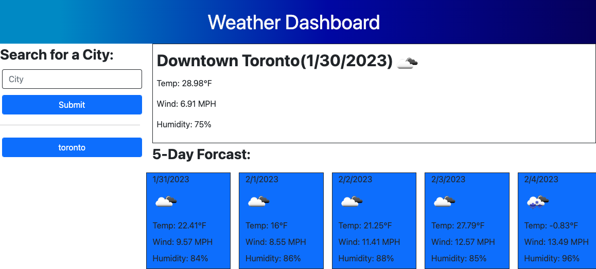

# Weather App

## Description

```
This app allows you to search for a city, and it will display the current weather for that city as well and the forcast for the next 5 days. It will also store you're previous searches in your local storage so you can look at them again.
```

## Table of Contents
- Where to find
- How to use
- Credits
- License
-Screenshot

## Where to find

Link: [Weather App]()

## How to use

This is a super simple program, all you have to do is search for the city you would like to find the weather for and click submit. Your search history will be saved underneath the search bar so you can look at them again.

## Credits

This application was designed by Connor with the help of the API OpenWeather website. Another shoutout goes to the University of Toronto for teaching me how to code!

## License

GNU GENERAL PUBLIC LICENSE
Version 3, 29 June 2007

## Screenshot

